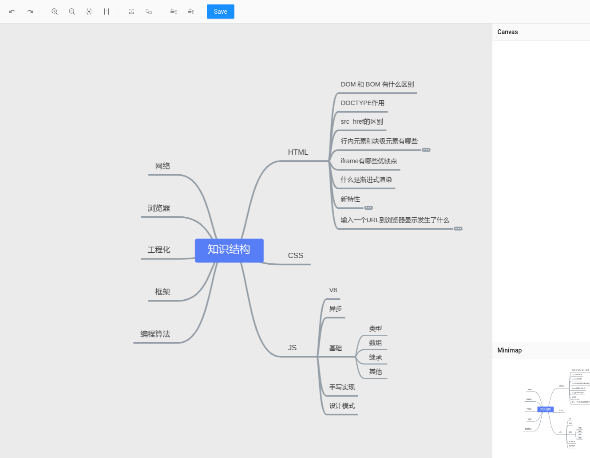

# Editor     

> 脑图编辑器，用熟悉的数据结构保存自己的知识体系。

## 预览



## :books: 目录

- [介绍](#memo-介绍)
- [环境准备](#package-环境准备)
- [运行脚本](#dart-运行脚本)
- [FAQ](#tada-FAQ)

## :memo: 介绍

由 `Umi` 脚手架生成

- 🍰 [React](https://github.com/facebook/react)
- 🍚 [Umi](https://github.com/umijs/umi)
- 🍫 [ES6](http://es6.ruanyifeng.com/)

## :package: 环境准备

安装 `node_modules`:

```bash
yarn install
```

## :dart: 运行脚本

在`package.json`可查看所有运行脚本

### 启动

```bash
yarn start
```

### 打包

```bash
yarn build
```

## :tada: FAQ
